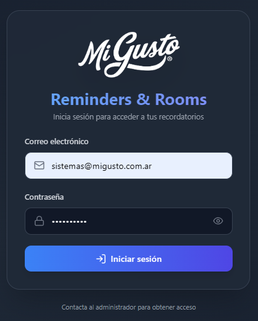
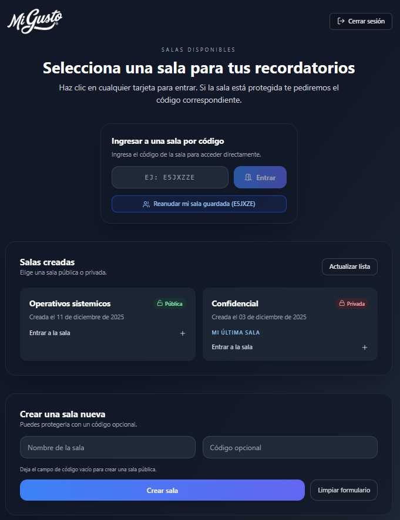
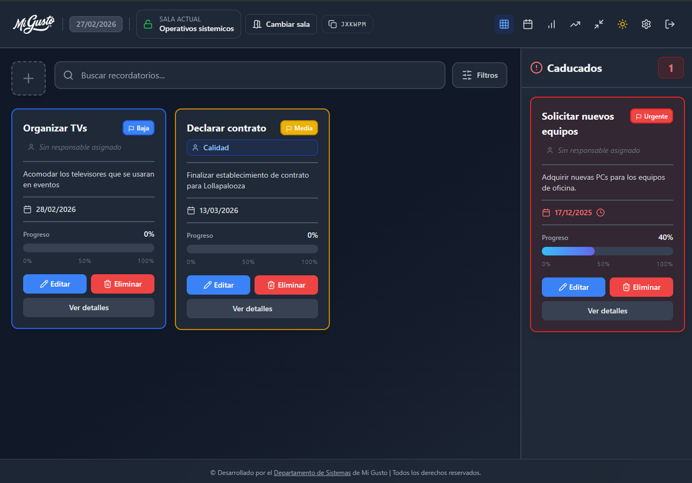
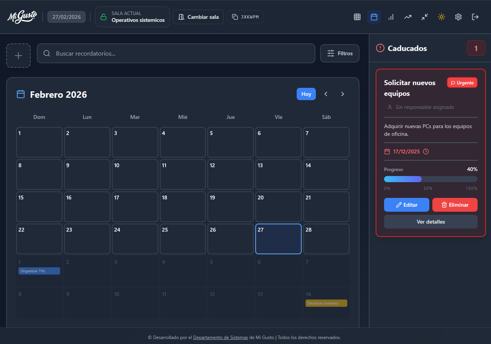

# Rooms – Reminders & Rooms

Aplicación interna de Mi Gusto para gestionar **recordatorios compartidos por salas** (rooms) con integración a **Supabase**, paneles de control y vistas avanzadas (tarjetas, calendario y diagrama de Gantt).

Permite organizar tareas por áreas, asignarlas a personas, aplicar prioridades y etiquetas, ver estadísticas y gestionar el acceso a cada sala.

## Demo

### Login

### Inicio

### Dashboard

### Vista en calendario

## Características principales

- **Autenticación con Supabase**
  - Login por correo y contraseña.
  - Manejo de errores detallado (credenciales inválidas, email sin confirmar, problemas de conexión, etc.).
  - Persistencia de sesión y compatibilidad con `localStorage`.

- **Gestión de salas (rooms)**
  - Creación de salas con código único y código de acceso.
  - Distinción entre salas propias y salas donde el usuario es miembro.
  - Control de privacidad y bloqueo/desbloqueo de salas.
  - Escucha en tiempo real de cambios en las salas mediante canales de Supabase.

- **Gestión de recordatorios**
  - Creación, edición y eliminación de recordatorios por sala.
  - Campos: título, descripción, fecha de vencimiento, prioridad, asignado a, etiquetas, etc.
  - Panel de recordatorios vencidos.
  - Filtros por estado (activos, vencidos, hoy, semana), prioridad, persona, etiquetas y texto de búsqueda.
  - Ordenamiento configurable (fecha de creación, vencimiento, título, prioridad).

- **Vistas y paneles**
  - Vista de tarjetas (cards) para trabajo diario.
  - Vista de calendario.
  - Vista tipo Gantt utilizando `frappe-gantt`.
  - Panel de estadísticas (`StatsPanel`) con métricas de uso y carga de trabajo.

- **Gestión de personas y etiquetas**
  - Selector de persona (`PersonSelector`) y gestor de personas (`PeopleManager`) para asignar tareas.
  - Selector de etiquetas (`TagSelector`) y gestión de tags almacenadas por sala.

- **Notificaciones por email**
  - Integración con **EmailJS** para enviar correos de asignación de recordatorios (`sendAssignmentEmail`).

- **Experiencia de usuario**
  - Modo claro/oscuro controlado por `useDarkMode`.
  - Atajos de teclado (por ejemplo `Ctrl+K` para búsqueda, `Ctrl+N` para nuevo recordatorio, `Ctrl+,` para configuración).
  - Animaciones y diseño moderno construido con **Tailwind CSS**.

## Tecnologías utilizadas

- **Frontend**
  - [React 18](https://react.dev/)
  - [TypeScript](https://www.typescriptlang.org/)
  - [Vite](https://vitejs.dev/) (ver `vite.config.ts`)
  - [Tailwind CSS](https://tailwindcss.com/)
  - [lucide-react](https://lucide.dev/) para iconos
  - [frappe-gantt](https://github.com/frappe/gantt) para la vista Gantt

- **Backend como servicio**
  - [Supabase](https://supabase.com/) para autenticación, base de datos, funciones en tiempo real y almacenamiento de datos de salas/recordatorios.

- **Email**
  - [EmailJS](https://www.emailjs.com/) para el envío de correos de notificación.

## Desarrolladores

- **[Facu14carrizo](https://github.com/Facu14carrizo)** · [LinkedIn](https://www.linkedin.com/in/facu14carrizo/)
- **[ramirolacci](https://github.com/ramirolacci)** · [LinkedIn](https://www.linkedin.com/in/ramiro-lacci/)

