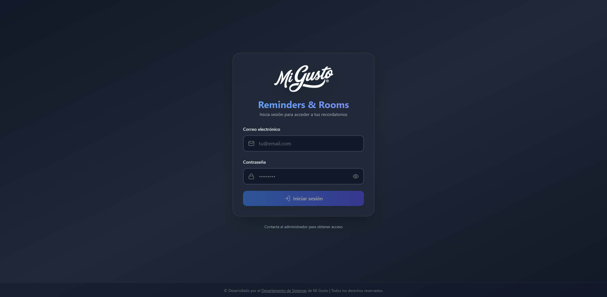
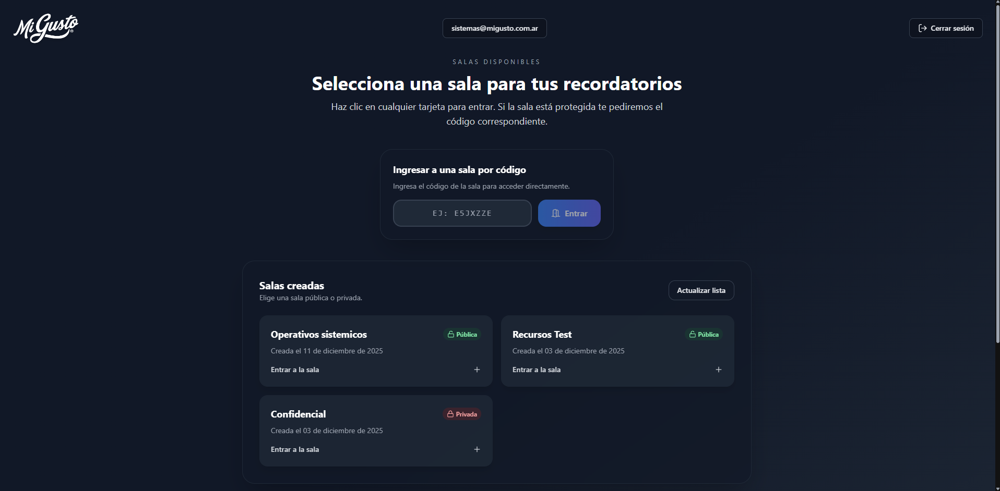
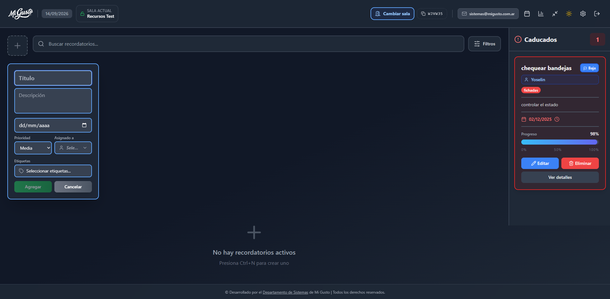
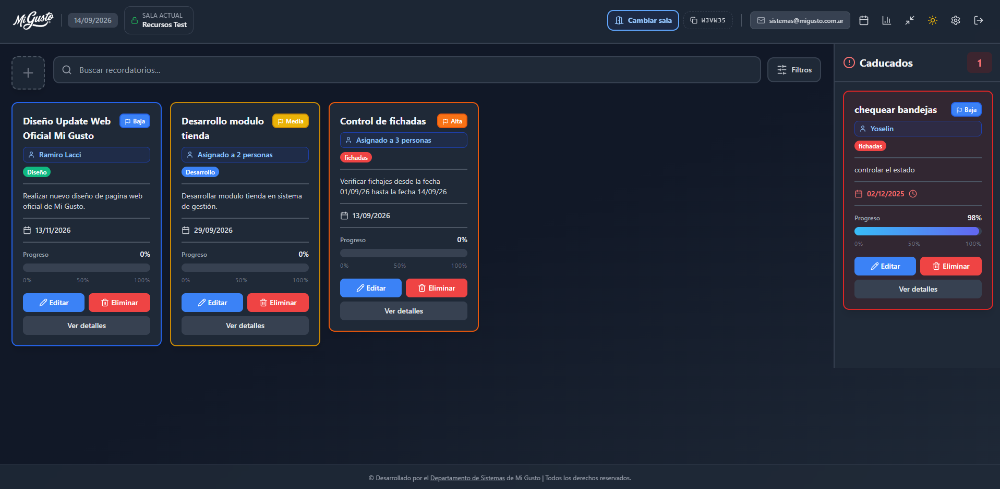

  <h1>✨ Reminders & Rooms (RR)</h1>
  
<b>Plataforma interna de gestión inteligente de recordatorios compartidos por salas para Mi Gusto</b>

  

    
    
    
    
    
  

---

## 🚀 Visión General

**Reminders & Rooms** es una aplicación colaborativa diseñada para optimizar la organización y seguimiento de tareas en equipo. Permite gestionar salas virtuales (*rooms*) independientes, delegar recordatorios a personas específicas, definir prioridades, monitorear fechas límite y analizar la productividad mediante múltiples vistas interactivas (Tarjetas, Calendario y Diagrama de Gantt).

---

## ✨ Funcionalidades Destacadas

- 🔐 **Autenticación & Seguridad Avanzada**: Gestión de sesiones en tiempo real integrada con **Supabase Auth**, manejo granular de errores de acceso y persistencia segura.
- 🏢 **Salas Colaborativas (Rooms)**: Creación de salas privadas o públicas con códigos de acceso únicos, control de miembros y sincronización en tiempo real vía WebSockets.
- 📋 **Gestión Integral de Tareas**:
  - Filtros avanzados por estado (activos, vencidos, hoy, semana), prioridad, etiquetas y personas asignadas.
  - Asignación inteligente a miembros con notificaciones instantáneas mediante **EmailJS**.
- 📊 **Múltiples Vistas Interactivas**:
  - **Vista de Tarjetas**: Flujo dinámico y visual para trabajo diario.
  - **Vista de Calendario**: Planificación temporal ordenada y clara.
  - **Diagrama de Gantt**: Cronograma interactivo de dependencias y tiempos.
- 📈 **Analítica & Panel de Estadísticas**: Métricas en tiempo real sobre la carga de trabajo del equipo y tasa de finalización de tareas.
- 🌙 **Modo Oscuro & Experiencia Fluida**: Interfaz moderna adaptable a temas claro/oscuro con atajos de teclado intuitivos (`Ctrl+K`, `Ctrl+N`, `Ctrl+,`).

---

## 🖼️ Galería de Imágenes

<table align="center" width="100%">
  <tr>
    <td width="50%" align="center">
      
       
      <b>Panel Principal & Salas Colaborativas</b>
    </td>
    <td width="50%" align="center">
      
       
      <b>Control de Tareas & Filtros Avanzados</b>
    </td>
  </tr>
  <tr>
    <td width="50%" align="center">
      
       
      <b>Vista en Calendario & Programación</b>
    </td>
    <td width="50%" align="center">
      
       
      <b>Diagrama de Gantt & Panel de Métricas</b>
    </td>
  </tr>
</table>

---

## 🛠️ Stack Tecnológico

- **Core & UI**: [React 18](https://react.dev/), [TypeScript](https://www.typescriptlang.org/), [Vite](https://vitejs.dev/)
- **Estilos & Diseño**: [Tailwind CSS](https://tailwindcss.com/), [Lucide React](https://lucide.dev/) (iconografía)
- **Visualización**: [Frappe Gantt](https://github.com/frappe/gantt) (diagramas cronológicos)
- **Backend & Realtime**: [Supabase](https://supabase.com/) (Auth, PostgreSQL Database & Realtime Channels)
- **Notificaciones**: [EmailJS](https://www.emailjs.com/) (Emailing automatizado)

---

## 👥 Equipo de Desarrollo

| Desarrollador | Enlaces |
| :--- | :--- |
| **Facundo Carrizo** |   |
| **Ramiro Lacci** |   |

